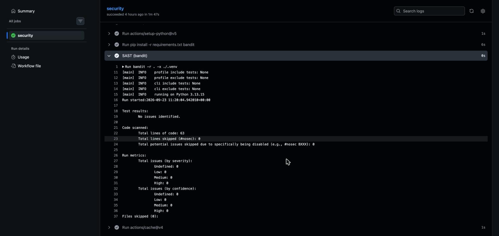
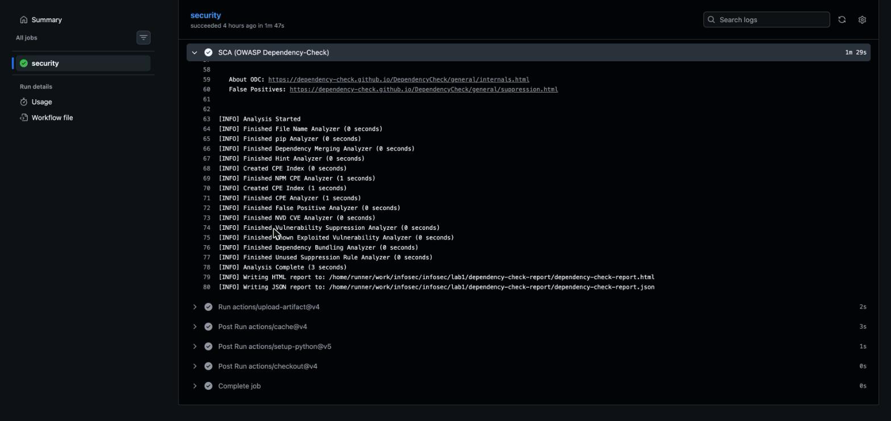

# Информационная безопасность

## Лабораторная работа №1

### Стек

- Python 3 / Flask
- SQLite (`sqlite3` из стандартной библиотеки)
- PyJWT
- bcrypt

### Запуск

```bash
python3 -m venv .venv
.venv/bin/pip install -r requirements.txt
ADMIN_PASSWORD=secret JWT_SECRET=$(openssl rand -hex 32) .venv/bin/flask --app app run
```

### Описание API

`POST /auth/login`: метод для аутентификации пользователя (принимает логин и пароль). Возвращает JWT, действительный 1 час.

```json
{
  "username": "admin",
  "password": "secret"
}
```

`GET /api/data`: метод для получения списка постов. Доступ только у аутентифицированных пользователей (заголовок `Authorization: Bearer <token>`).

`POST /api/posts`: метод для создания поста. Доступ только у аутентифицированных пользователей. Автором становится пользователь из токена.

```json
{
  "text": "Hello"
}
```

### Описание реализованных мер защиты

- От **SQLi** код защищен с помощью параметризованных запросов: значения передаются драйверу `sqlite3` через плейсхолдеры `?`, конкатенация строк в SQL не используется.

```python
c.execute("SELECT password_hash FROM users WHERE username = ?", (username,))
c.execute("INSERT INTO posts (author, text) VALUES (?, ?)", (g.user, text))
```

- От **XSS** защищен с помощью экранирования пользовательских данных в ответах API (`html.escape`).

```python
return jsonify([{"id": i, "author": html.escape(a), "text": html.escape(t)} for i, a, t in rows])
```

- От **Broken Authentication** защищен так:
  - пароли хранятся только в виде bcrypt-хэшей с солью, пароль администратора берется из переменной окружения;
  - при неверном логине и при неверном пароле возвращается одинаковая ошибка `invalid credentials`;
  - после входа выдается JWT (HS256, срок жизни 1 час), который проверяется middleware на всех защищенных эндпоинтах. Алгоритм задан явно, поэтому подмена на `alg: none` не проходит.

```python
def auth_required(f):
    @wraps(f)
    def wrapper(*args, **kwargs):
        token = request.headers.get("Authorization", "").removeprefix("Bearer ")
        try:
            g.user = jwt.decode(token, SECRET, algorithms=["HS256"])["sub"]
        except jwt.PyJWTError:
            return jsonify(error="unauthorized"), 401
        return f(*args, **kwargs)
    return wrapper
```

### Отчеты из pipeline

При каждом `push` и `pull_request` в GitHub Actions запускаются SAST ([bandit](https://github.com/PyCQA/bandit)) и SCA ([OWASP Dependency-Check](https://github.com/dependency-check/DependencyCheck)). Если сканер находит проблему, pipeline падает.

Bandit:



Dependency-check:



### Последний запуск пайплайна

https://github.com/skadibtw/infosec/actions/runs/35853896287
